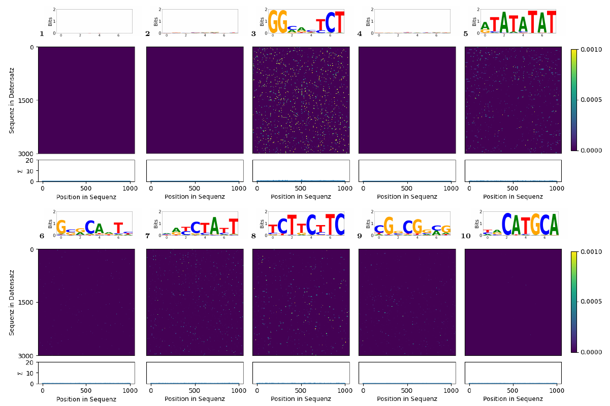

This is a link in Markdown: [Cockett, 2022](https://doi.org/10.5281/zenodo.6476040).

# Methods for Interpreting Neuronal Networks in Sequence Data Analysis - *Thesis Summary*

A short walkthrough of my Master's thesis: applying Integrated Gradients to Binary-CNNs for motif discovery in DAP-seq data. I'm not explaing the exact procedure.  

- **Code:** Not publicly available.
- **Data:** Provided by supervisor; not publicly shareable.

## Abstract

Integrated Gradients (an XAI method) were applied to Binary-CNNs to detect motif positions in sequential DAP-seq data, without relying on statistical models such as Hidden Markov Models. While the exact procedure is not reproduced here, results demonstrate that motif positions can be identified even when multiple motifs are present. Analysis was performed on sequences cropped around known motifs from *Arabidopsis thaliana*, provided by the supervisor following peak calling.

## Introduction

### DeepBind (Model)
- I rebuilt [DeepBind's](doi:10.1038/nbt.3300) architecture using TensorFlow and Keras [tensorflow2015-whitepaper] but applied certain adaptations like different preprocessing and a reverse complement aware computation
- This architecture allowed me to extract the first convolutional layer as a collection of motifs

### Integrated Gradients

- Integrated Gradients (IG) [IG] allowed me to assign attribute values to the input data, for their importance of a correct prediction
- Official Implementation: https://keras.io/examples/vision/integrated_gradients/
- Formally:

$$
IG_{i}(x) = (x_{i} - x'_{i})\times\int_{\alpha = 0}^{1}\frac{\partial F(x'+\alpha(x - x'))}{\partial x_{i}}d\alpha
$$

### Model Evaluation

- I picked the best models based on an experimental evaluation using multiple seeds with different activation functions

### Kernels as Motifs

- Since the convolutional kernel can consist of any real number, I applied a softmax function to transform into probability matrices
- Those probability matrices can then be further transformed into sequence logos for investigation

## Results

### Model Evaluation

- Fig. 1 demonstrates that certain activation functions were not as applicable as other functions, hence I evaluated only the best performer (highlighted in red)

*Figure 1: An example of the AUC validation using validation data sets. Red square highlights the best performing experiment.*

### Kernels to Motifs

- Fig. 2 shows an example of such a motif collection that the model learned
- For example: TATA-boxes (Motif 5), CATGCA (Motif 10), ...

*Figure 2: Motif collection of an experiment.*

### Motif Positions

- Fig. 3 visualizes when our procedure successfully found the motif positions
- Clearly visible in the 3rd row, first two columns

*Figure 3: Motif position throughout the full dataset.*